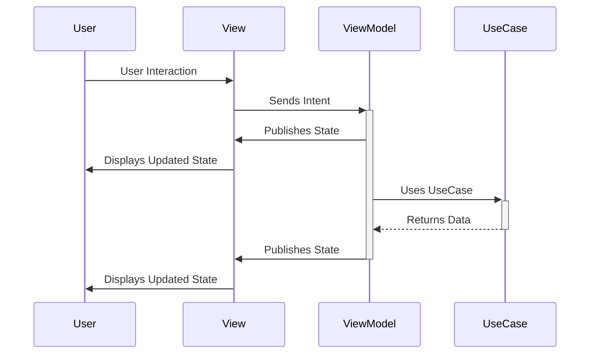
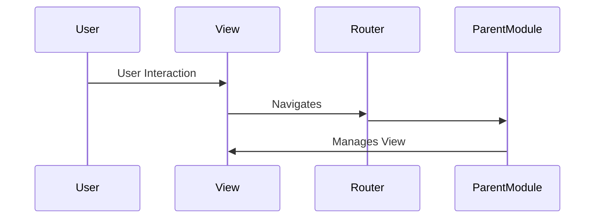
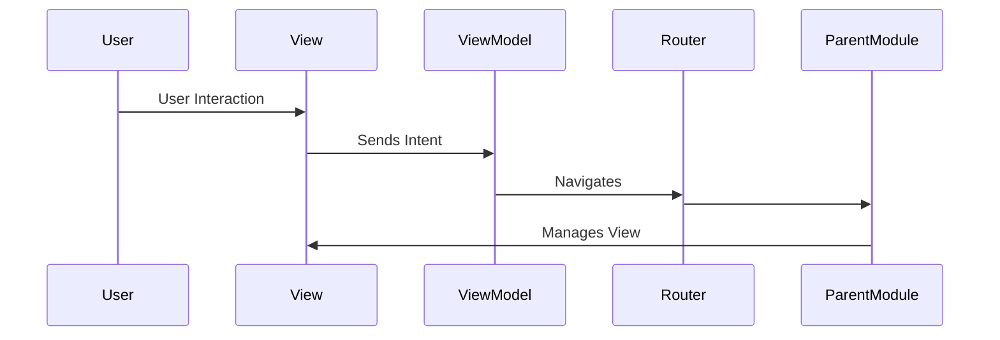

# Presentation Layer

This folder contains the Presentation Layer of the Module: Views, ViewModels, ViewStates, Routing.

## MVVM + Intents
The Presentation Layer follows the MVVM (Model-View-ViewModel) pattern.

- **Models**: Data structures representing the screen state.
- **Intents**: Used to pass user interactions to the ViewModel.
- **View**: SwiftUI View responsible for displaying the state provided by the ViewModel.
- **ViewModel**: Prepares data for the view.
- **Router**: Manages navigation between screens.

### Class Structure
- **State**: Data structure with properties like `name: String`.
- **Intent**: Enum with cases like `loadData`, `updateName(String)`, `store`.
- **View**: SwiftUI View with `@StateObject viewModel: ViewModel`.
- **ViewModel**: ObservableObject with `@Published state: State` and methods like `handle(intent: Intent)`.
- **Router**: Protocol with methods like `show(destination: Destination)`.
- **RouterImp**: Struct implementing `Router`.

### Relationships
- `RouterImp` manages `View` and implements `Router`.
- `View` navigates `Router` and observes `State` via `ViewModel`.
- `ViewModel` navigates `Router`, provides `State`, and handles `Intent`.

### Sequence Diagrams

#### User Interaction


#### Navigation


#### Navigation within Flow


## Model
Models are immutable data structures representing the screen state, created by the ViewModel. They can be simple structs or more complex to represent loading, error states, etc.

```swift
enum State {
    case loading
    case loaded([Product])
    case storing
    case loadingError(LoadingError)
    case storingError(StoringError)

    enum LoadingError {
        case networkError
    }

    enum StoringError {
        case networkError
        case invalidData
    }
}
```

## Intents
Intents pass user interactions to the ViewModel, usually represented as an enum with associated values for data.

```swift
final class ViewModel: ObservableObject {
    enum Intent {
        case fetchProducts
        case filterByName(String)
    }
}
```

## View
SwiftUI View displaying the state provided by the ViewModel, passing user interactions as Intents.

```swift
import SwiftUI

public struct ProductsView: View {
    let router: ProductsViewRouter
    @ObservedObject var viewModel: ProductsViewModel

    public var body: some View {
        List(viewModel.products) { product in
            Text(product.name)
            Button("Show details") {
                router.showProductDetails(for: product)
            }
        }
        .onAppear {
            viewModel.perform(.fetchProducts)
        }
    }
}

struct ProductsViewPreview: PreviewProvider {
    struct ProductsViewRouterMock: ProductsViewRouter {
        func showProductDetails(for product: Product) { }
    }

    static var previews: some View {
        ProductsView(
            router: ProductsViewRouterMock(),
            viewModel: .mock
        )
    }
}
```

## ViewModel
Class responsible for preparing data for the view, handling user interactions by processing Intents, and interacting with UseCases.

```swift
import Combine

final class ProductsViewModel: ObservableObject {
    enum Intents {
        case fetchProducts
        case filterByName(String)
    }

    @Published var products: [Product] = []
    @Published var isLoading: Bool = false

    init(getProductsUseCase: GetProductsUseCase) {
        self.getProductsUseCase = getProductsUseCase
    }

    func perform(_ intent: Intents) {
        switch intent {
        case .fetchProducts:
            Task {
                isLoading = true
                do {
                    products = try await getProductsUseCase.execute()
                } catch {
                    print("Error fetching products: \(error)")
                }
                isLoading = false
            }
        case .filterByName(let productName):
            // TBI
            break
        }
    }

    private let getProductsUseCase: GetProductsUseCase
}
```

## Router
Protocol with the method `show(destination:)` for navigation.

```swift
enum Destination {
    case productDetails(Product)
    case settings
}

protocol Router {
    func show(destination: Destination)
}
```
